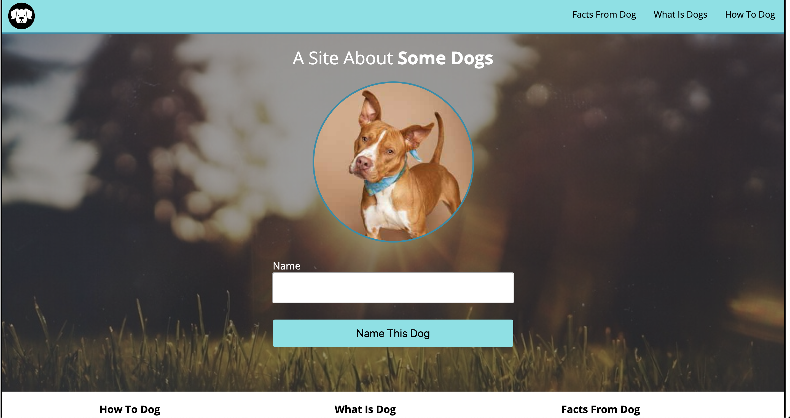

# Dog Party Mod 1 Week 1 Solo Project

## Description 
Day one of Mod 1, 1908 cohort was assigned the dog party project at project kick-off. Assignment was to use our skills
and knowlege to recreate a comp of `A Site About Some Dogs`. With this project, I was able to explore different sources,
seek help from other memebers at Turing, and learn new methods of executing my goals. This project also allowed us to 
take what we learned in class and implement it into our work. The project consisted of 3 main languages...HTML, CSS, and
Javascript. We added all the contents of the page as well as the physical appearence and some functionality. 

## Results

