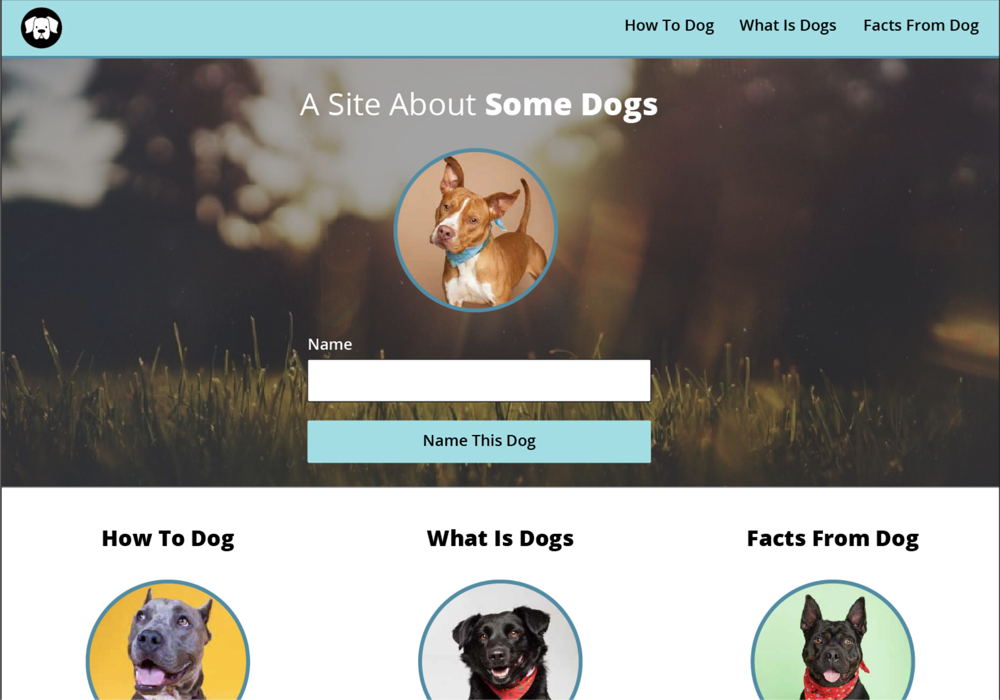
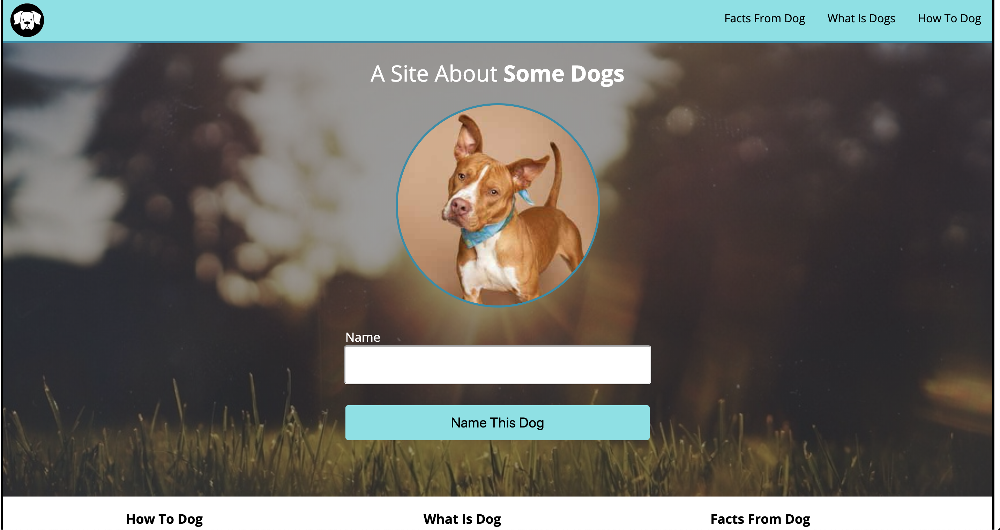

# Dog Party Mod 1 Week 1 Solo Project

## Description 
Day one of Mod 1, 1908 cohort was assigned the dog party project at project kick-off. Assignment was to use our skills
and knowlege to recreate a comp of `A Site About Some Dogs`. With this project, I was able to explore different sources,
seek help from other memebers at Turing, and learn new methods of executing my goals. This project also allowed us to 
take what we learned in class and implement it into our work. The project consisted of 3 main languages...HTML, CSS, and
Javascript. We added all the contents of the page as well as the physical appearence and some functionality. 

## Results
Original comp

My Copy 

### Usage
With this site, we have the ability to rename the dog in the beginning through the input box in the form. I was unable to get through 2nd and 3rd iterations but found an abundance of knowlege getting to the point I am now. 

### Wins and Losses 
Through out this project I was able to expand my knowlege on HTML by learning how to organize myself with all the tags and elements and using that to my power when it came to CSS. Although I learned that through a fairly painful experience of not being able to read my own code for while. I wasn't able to get to the next iterations, although I did research some information and might have some ideas on how to approach the next steps.
